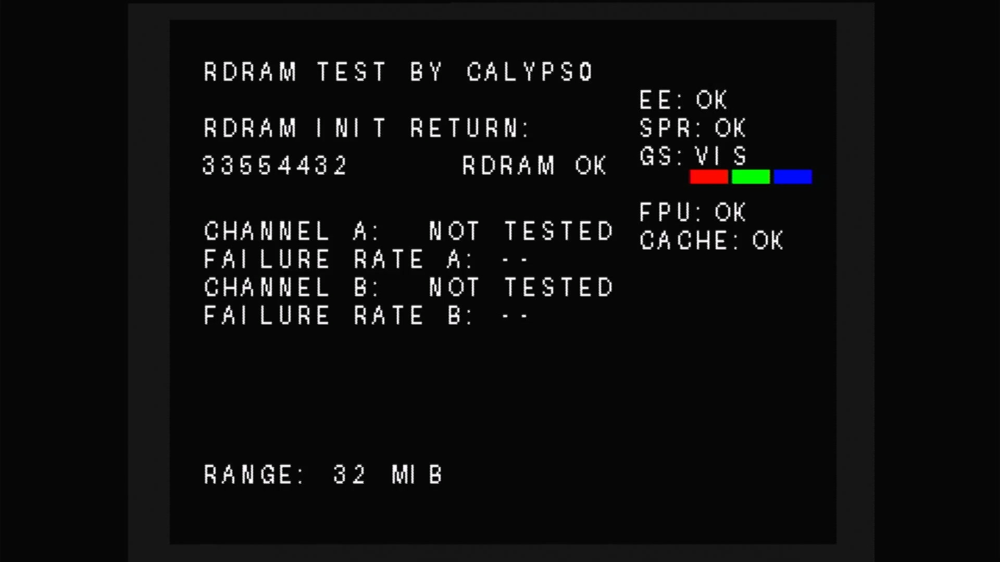
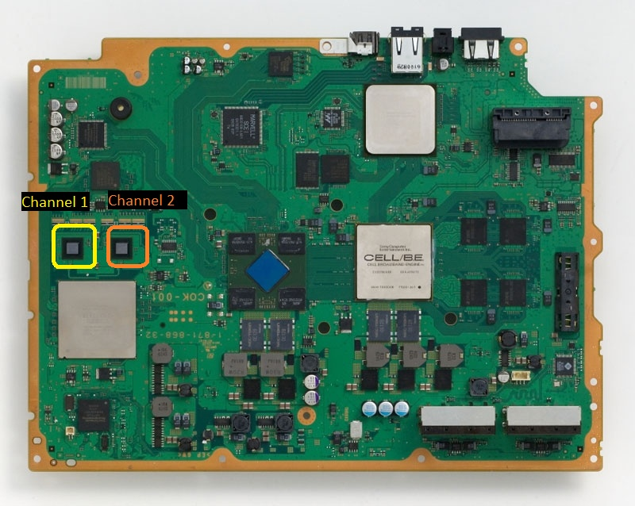

# Experimental PS2 Hardware Diagnostic for PS3 (UART NOT REQUIRED)

This diagnostic runs inside the PS2 subsystem of a compatible PS3 (CECHA/B models - or COK-001 boards). 
Unlike the previous release that only works over UART, this version can display test results without having to solder the adapter to EEGS UART pads.

(Due to many different broken revisions from before, this tool is currently designated as V59 - aka revision 59)



## What the abbreviations mean

### EE — Emotion Engine

The **Emotion Engine** is the PS2's main processor. It executes the PS2 program
code and coordinates the other PS2 hardware.

The V59 EE check performs a small deterministic set of integer arithmetic,
bitwise, multiplication, division, and shift operations. The calculated values
are compared with known correct values.

- `EE: OK` means those tested CPU instructions returned the expected results.
- `EE: FAIL` means at least one result was wrong.
- This is a functional spot check, not a complete test of every EE instruction,
  register, interface, or operating condition.

### SPR — Scratchpad RAM

**SPR** means the EE's small, fast **scratchpad memory**. It is separate from the
32 MiB RDRAM and can be addressed directly by the processor.

The diagnostic writes four data patterns across the unused scratchpad test area
and reads them back:

- `00000000`
- `FFFFFFFF`
- `AAAAAAAA`
- `55555555`

`SPR: OK` means every tested location retained all four patterns correctly.
It does not test every possible access timing or interaction with other units.

### FPU — Floating-Point Unit

The **Floating-Point Unit** is part of the EE and performs calculations involving
fractional numbers.

The diagnostic enables the FPU, calculates `1.5 + 2.25`, and checks that the
exact expected single-precision result, `3.75`, is returned.

- `FPU: OK` confirms this calculation and its register transfer path worked.
- It is a basic functional check, not an exhaustive FPU accuracy test.

### CACHE — EE Data Cache

The **cache** is very fast memory inside the EE that temporarily holds data from
main memory. Software must keep cached and uncached views of memory consistent.

The diagnostic writes known values through cached and uncached RDRAM addresses,
uses EE data-cache writeback and invalidation operations, and verifies that the
expected values become visible through both views.

- `CACHE: OK` means the tested cache-coherency sequence behaved correctly.
- This is not a complete test of every cache line, tag, replacement condition,
  or instruction-cache function.

### GS — Graphics Synthesizer

The **Graphics Synthesizer** is the PS2 graphics processor. It generates the
video signal and has its own VRAM.

V59 displays `GS: VIS`. **VIS means visible.** This is deliberately not labelled
`GS: OK`, because V59 does not run a complete GS core or GS VRAM verification.
The readable screen and red/green/blue bars provide visible evidence that the
basic graphics path is working well enough to configure a display and draw the
diagnostic interface.

`GS: VIS` does **not** prove that every GS function or every VRAM location works.
The experimental GS core and VRAM readback checks from V58 were removed because
they reported false failures on a console with a working PS2 subsystem. At this
early interception point, the normal later graphics initialization has not
necessarily occurred.

## RDRAM behavior

`RDRAM INIT RETURN` is the actual value returned by the original `InitRDRAM`
routine. The initialization sequence and its settings are not changed.

- A zero or positive return displays `RDRAM OK`, skips the long 32 MiB sweep,
  and runs EE, SPR, FPU, and CACHE checks.
- A negative return displays `RDRAM FAIL` and attempts the Channel A and Channel
  B memory sweep. The other component checks remain `N/T` because they are not
  considered trustworthy without successfully initialized RDRAM.
- `N/T` means **not tested**. It never means OK.

`FAILURE RATE A` and `FAILURE RATE B` are calculated from actual RDRAM data
mismatches observed during the corresponding channel test.

On COK-001 motherboards, the channels should correspond to:

Channel A	- IC7002 (leftside rdram)<br>
Channel B	- IC7003 (rightside rdram)<br>




## Understanding the result

An `OK` result means the specific operation performed by this program passed.
It does not certify the entire component under every workload. A failed result
is useful diagnostic evidence, but the surrounding initialization state and
test limitations must also be considered before declaring a chip defective.

For RDRAM test you can also check some of the return codes through the link here (made by Kozarovv): https://www.psdevwiki.com/ps3/index.php?title=User_talk:Kozarovv&curid=9418&diff=78129&oldid=78114


SOME ADDITIONAL NOTES:

The EE+GS must be at least partially functional and powered for this diagnostic to run and appear on screen. The test works around faulty RDRAM; it cannot work around a dead EE+GS processor.

The minimum requirements are:

- EE core powered, clocked, and released from reset — it executes the diagnostic code.<br>
- EE scratchpad working sufficiently — the diagnostic uses scratchpad for its stack, variables, font-rendering packets, and test state.<br>
- ROM/firmware path accessible — the modified program must be fetched and executed.<br>
- GS partially operational — it must accept basic drawing commands and generate video.<br>
- EE-to-GS/GIF path operational — required to send the text and colour-bar commands.<br>
- Relevant PS2 subsystem power rails, clocks, and reset logic present.<br>
- Enough surrounding PS3/PS2 boot infrastructure functioning to reach InitRDRAM.<br>

RDRAM is different because the diagnostic itself is deliberately kept out of RDRAM. Its important code and constant data are in ROM, while temporary state and graphics packets use EE scratchpad. Therefore it can potentially continue after InitRDRAM returns an error and test the damaged RDRAM.

Typical outcomes:

| Fault                                      | Likely result                                                             |
| ------------------------------------------ | ------------------------------------------------------------------------- |
| RDRAM initialization fails but EE+GS works | Diagnostic appears; actual negative return and A/B tests are shown        |
| Some RDRAM locations are faulty            | Diagnostic may appear and report channel errors/failure rates             |
| EE calculation fault but EE still executes | Possibly `EE: FAIL`                                                       |
| Scratchpad partly faulty                   | Incorrect display, freeze, or `SPR: FAIL`, depending on the affected area |
| GS drawing path partly faulty              | Corrupted/missing text or colour bars                                     |
| GS completely unpowered                    | No usable diagnostic picture                                              |
| EE completely unpowered or held in reset   | Program does not execute at all                                           |
| EE clock/power is unstable                 | Freeze, crash, corrupt display, or no screen                              |


This package reconstructs the exact hardware-tested
`Calyps0_V59_Stable_EE_Tests.elf` from two user-supplied Sony files. 

## Required inputs

`ps2_emu.elf` from Kozarovv (found here - https://www.psx-place.com/resources/release-ps2_emu-gxemu-and-netemu-modded-by-kozarovv-fan-control-cell-rsx-temps-fps-indicator.1680/) SHA-256:

```text
7506392cad6b9c5829c087d9873c0a2b0c3a85b3f1f1bc8289e5939ffd305a7e
```

PlayStation 2 TEST (DTL-H30101) BIOS 1.50 ( found here - https://archive.org/details/PlayStation2DTLH30101BIOS150 )`ROM0` SHA-256:

```text
79c55576524ee8aae590d85d7581b1b725e6519c427071392e36b3b1f7662856
```

The builder extracts `TESTMODE` from the TEST BIOS through ROMDIR and verifies
its SHA-256 before using it.

## Build

```bat
py build_v59.py ps2_emu.elf py build_v59.py ps2_emu.elf "DTL-H30101_USA_Dev_0150_20001228_v4_[CC645DA1].rom0" build
```

Expected output:

```text
build/Calyps0_V59_Stable_EE_Tests.elf
SHA-256: 3d76f20447c909ee2878d755470e1b1d9eeeca522d83ce4258b8740631ec802c
```

The script verifies every intermediate stage and refuses to produce an output
if any prerequisite differs.

## Reconstructed stages

1. Extract the 92,728-byte `TESTMODE` ELF from the supplied PlayStation 2 TEST BIOS.
2. Replace the embedded retail `OSDSYS` ELF in the original emulator and clear
   the unused portion of its slot, exactly reproducing Build A.
3. Apply the documented instruction changes embedded directly in
   `build_v59.py`
4. Assemble the readable V59 MIPS diagnostic, font and GS packets from
   `v59_payload.py` and install its hooks.
5. Verify the completed ELF against the known working V59 SHA-256.

## Source files

- `build_v59.py` performs and verifies the complete staged build.

- `v59_payload.py` contains the V59 assembler and diagnostic implementation.

- `requirements.txt` lists Pillow, used to generate the compact raster font.

## Rebuild the SELF

```bat
scetool.exe -v -0 SELF -1 TRUE -t ps2_emu.self -e build\Calyps0_V59_Stable_EE_Tests.elf ps2_emu_testmode_v59.self
```

Use the matching SELF template and keys from your own legally obtained system.


## Binary and copyright notice

This repository intentionally does **not** include a PS2 BIOS, Sony `ps2_emu`
binary, the base ELF, SCETool keys, or any other proprietary Sony file. The
user must legally provide the exact base ELF. The MIT license applies only to
the original source code and documentation in this package—not to Sony software
or to a patched ELF produced from it.


## Credits:

Original RDRAM testing logic based on PS2's TESTMODE

PS3 integration, channel/range diagnostics and UART output by Calyps0/ChatGPT. 

**THE TEST WAS COMPILED WITH AI ASSISTANCE, HOWEVER IT HAS BEEN REVISED NUMEROUS TIMES UNTIL FUNCTIONALY WAS ACCEPTABLE**

**THIS IS AN EXPERIMENTAL REPAIR AND RESEARCH TOOL. USE AT YOUR OWN RISK.**

