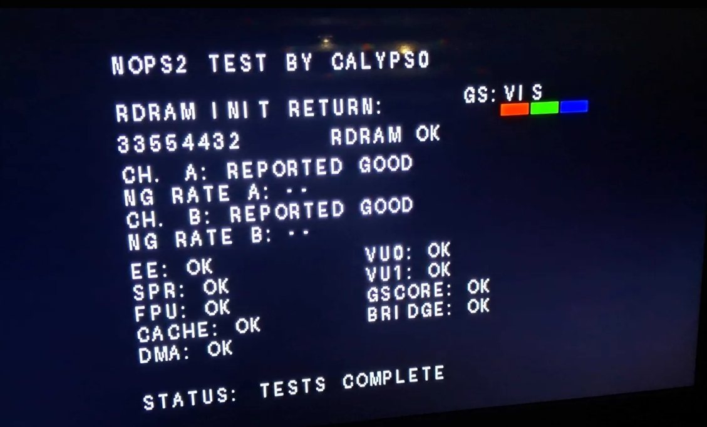

## Experimental PS2 Hardware Diagnostic for PS3 (UART NOT REQUIRED) 

### **UPDATED on 15.9.2026**
- **More component tests have been added**
- **Source code updated and cleaned**
- **Read me updated**

This diagnostic runs inside the PS2 subsystem of a compatible PS3 (CECHA/B models - or COK-001 boards). 
Unlike the previous release that only works over UART, this version can display test results 
without having to solder the adapter to EEGS UART pads.

Alternatively can also still find RDRAM-only UART version from here: https://github.com/Calyps0man/rdram-ps3test





## Hardware required for the diagnostic to appear

The tool can work around an `InitRDRAM` error that returns control to software,
but it cannot work around a completely dead EE+GS processor. At minimum, the
following must function sufficiently:

- EE core power, clock and reset release, so the processor can execute code.
- EE scratchpad, used for the stack, temporary state, font rendering and GS
  packets.
- ROM and firmware execution path.
- GS display hardware sufficiently to accept the drawing commands and produce
  video.
- EE-to-GS/GIF path used to submit text and colour-bar commands.
- Required PS2 subsystem power rails, clocks and reset logic.
- Enough surrounding PS3 boot infrastructure to reach `InitRDRAM`.

The important diagnostic code and constant data are kept outside RDRAM, while
temporary state uses EE scratchpad. This is what allows the diagnostic to
potentially continue after `InitRDRAM` returns an error and then attempt the
RDRAM sweep.


## RDRAM initialization behavior

### Successful initialization

When `InitRDRAM` returns zero or a positive value:

- The actual return value and `RDRAM OK` are displayed.
- The destructive 32 MiB memory sweep is skipped.
- `CH. A` and `CH. B` display `REPORTED GOOD`.
- `NG RATE A` and `NG RATE B` display `--`, because the diagnostic did not
  measure a mismatch rate.
- The component tests run sequentially.

`REPORTED GOOD` means that the original initializer accepted the channel. It is
not a result from the extended memory sweep.

### Failed initialization

When `InitRDRAM` returns a negative value:

- The actual signed return code and `RDRAM FAIL` are displayed.
- The normal failure abort is bypassed into the independent diagnostic.
- The Channel A and Channel B RDRAM sweep is attempted.
- Each active channel row displays `TEST IN PROGRESS` during the sweep.
- The bottom status row displays the current `WRITE` or `READ` stage, pass
  number and progress bar.
- Completed channel results replace the progress text with `OK` or `FAIL`.
- `NG RATE A` and `NG RATE B` show percentages calculated from actual data
  mismatches.
- Component tests remain `N/T`, because they are not executed after failed
  RDRAM initialization.

`N/T` means **not tested**. It never means that a component passed.

All changing screen fields are cleared before their replacements are drawn, so
old channel and status text should not remain underneath a new result.

## RDRAM sweep

The extended test covers the complete 32 MiB PS2 RDRAM address space, one
channel at a time. Four fixed patterns are written and read in separate passes:

```text
00000000
FFFFFFFF
AAAAAAAA
55555555
```

A fifth address-uniqueness pass writes each word's address as its value. This
can reveal address aliasing that fixed data patterns may miss.

The NG rate is calculated from the number of mismatched values observed during
the corresponding channel test.

On COK-001 motherboards, the channel labels should correspond to:

| Diagnostic channel | RDRAM device |
| --- | --- |
| Channel A | IC7002, left-side RDRAM |
| Channel B | IC7003, right-side RDRAM |


## Component tests

These tests run only when the original RDRAM initialization succeeds.

| Screen row | Meaning and operation tested |
| --- | --- |
| `EE` | **Emotion Engine**, the PS2 main processor. Checks deterministic integer arithmetic, bitwise operations, shifts, multiplication and division against known results. |
| `SPR` | **Scratchpad RAM**, the EE's small internal high-speed memory. Writes and reads four patterns through an unused scratchpad window. |
| `FPU` | **Floating-Point Unit**. Temporarily enables COP1, calculates `1.5 + 2.25`, and checks for the exact single-precision result `3.75`. |
| `CACHE` | **EE data cache**. Checks a cached/uncached RDRAM coherency sequence using data-cache writeback and invalidation operations. |
| `DMA` | Transfers 64 bytes from scratchpad to RDRAM and back through EE DMAC channels 8 and 9, uses bounded completion waits, and compares the returned data. |
| `VU0` | Writes two patterns through 1 KiB of VU0 micro memory and 1 KiB of VU0 data memory, reads them back, and then clears the tested memory. |
| `VU1` | Writes two patterns through 1 KiB of VU1 micro memory and 1 KiB of VU1 data memory, reads them back, and then clears the tested memory. |
| `GSCORE` | Checks for a plausible Graphics Synthesizer ID/revision and performs a save/write/read/restore operation on `SIGLBLID`. |
| `BRIDGE` | Saves, writes, reads and restores two words through the EE-visible IOP RAM window. This checks that data path, not a complete initialized SIF protocol transaction. |


## GS:VIS

`GS` means **Graphics Synthesizer**, the PS2 graphics processor. `VIS` means
**visible**.

The readable diagnostic screen and red, green and blue bars show that the GS
display path is functional enough to configure video and draw the interface.
`GS:VIS` deliberately does not claim that every GS function or every GS VRAM
location works.

GS:VIS also confirms that the PS2 GS display path and the PS3 video-output chain, including sufficient RSX and HDMI functionality, are working well enough to produce the visible diagnostic screen. It is not a complete GS, RSX, VRAM, or HDMI-interface test.


## Understanding the result

An `OK` result means the specific operation performed by this program passed.
It does not certify the entire component under every workload. A failed result
is useful diagnostic evidence, but the surrounding initialization state and
test limitations must also be considered before declaring a chip defective.


Possible displayed results include:

- `OK` — the specific operation returned the expected result.
- `FAIL` — a comparison or functional check failed.
- `TIMEOUT` — a bounded hardware wait did not complete.
- `BAD RESP` — a hardware response was implausible or unexpected.
- `FAIL MEM` — a tested local memory comparison failed.
- `FAIL DATA` — a completed transfer returned incorrect data.
- `N/T` — the test was not executed.

These are targeted functional probes, not exhaustive production
certifications. `OK` means the operation described above passed; it does not
prove that every instruction, memory location, timing condition or interface is
perfect.

Possible situations:

| Fault | Likely observable result |
| --- | --- |
| RDRAM initialization fails but EE+GS remains functional | Diagnostic appears, displays the negative return code, and attempts Channel A/B testing. |
| Some RDRAM locations are faulty | Channel test may finish with `FAIL` and a non-zero NG rate. |
| RDRAM access stalls the EE indefinitely | Display may freeze at the last visible sweep stage and progress position. |
| EE calculation fault while execution remains possible | `EE: FAIL` may be displayed. |
| Scratchpad is partly faulty | Corrupted output, a freeze, or `SPR: FAIL`, depending on the affected area. |
| GS drawing path is partly faulty | Corrupted or missing text and colour bars. |
| GS is completely unpowered | No usable diagnostic picture. |
| EE is completely unpowered or held in reset | The program does not execute, so no RDRAM result can appear. |
| EE clock or power is unstable | Freeze, crash, corrupted display, or no screen. |

## Important limitations

- If `InitRDRAM` itself hangs and never returns, the diagnostic hook is never
  reached.
- If a direct RDRAM bus transaction stalls the EE completely, software cannot
  execute a timeout handler. The last visible status is then the best available
  indication of where it stopped.
- Component results can be affected by the unusually early execution stage.
- `BRIDGE: OK` indicates that the CXD9802GP bridge and the associated EE-to-IOP data path are functional enough to complete this transaction. It does not test every CXD9802GP function or perform a complete initialized SIF protocol test.
- The screen is deliberately held after testing; the tool does not continue to
  a game or normal PS3 operation.

## Required build inputs

The repository does not include the proprietary Sony binaries. Supply these
files separately:

`ps2_emu.elf` from Kozarovv (found here - https://www.psx-place.com/resources/release-ps2_emu-gxemu-and-netemu-modded-by-kozarovv-fan-control-cell-rsx-temps-fps-indicator.1680/) SHA-256:

```text
SHA-256: 7506392cad6b9c5829c087d9873c0a2b0c3a85b3f1f1bc8289e5939ffd305a7e
```

`TEST_rom0` PlayStation 2 TEST DTL-H30101 BIOS 1.50  ( found here - https://archive.org/details/PlayStation2DTLH30101BIOS150 ) SHA-256:

```text
SHA-256: 79c55576524ee8aae590d85d7581b1b725e6519c427071392e36b3b1f7662856
```

### Build files

- `build_v68.py` — validates the inputs and constructs the final ELF.
- `v68_payload.py` — contains the MIPS assembler and diagnostic implementation.
- `font.bin` — compact raster font used by the on-screen renderer.
- `verify_v68.py` — optional static verification of the completed ELF.
- `build_v68_final.bat` — optional Windows build launcher.

## Build the ELF

Place the build files and both required input binaries in the same folder, then
run:

```bat
py build_v68.py ps2_emu.elf "TEST_rom0" build
```

Alternatively, double-click `build_v68_final.bat`.

Expected output:

```text
build\Calyps0_V68_NoPS2_Test.elf
```

Expected SHA-256 for the cleaned-source build:

```text
2f8c17586b977b1eb0752c8a89abca7985c8f459e54569614a2bf76485d0a581
```

The builder verifies the input hashes and intermediate stages and refuses to
produce an output when a required prerequisite differs.

## Verify the ELF (not mandatory)

Run:

```bat
py verify_v68.py "build\Calyps0_V68_NoPS2_Test.elf"
```

Successful verification ends with:

```text
Current V68 payload, display text and control flow verified
```

This is static software verification. It confirms the expected file hash,
payload, hooks, display strings and selected control-flow properties. It cannot
replace testing on real hardware.

## Build the SELF

Use the matching SELF template and keys from your own legally obtained system:

```bat
scetool.exe -v -0 SELF -1 TRUE -t ps2_emu.self -e build\Calyps0_V68_NoPS2_Test.elf Calyps0_V68_NoPS2_Test.self
```

^^^That would be your final file, rename it into ps2_emu.elf before copying it into dev_blind.


## Source and build design

The PC-side build system is written in Python. The diagnostic payload is MIPS
machine code generated by the small assembler in `v68_payload.py`.

The custom NoPS2 diagnostic does not continue into the original TEST BIOS test
application. Some unused code and strings from the embedded display base remain
inside the completed ELF, but they are not the displayed V68 tests.

## Binary and copyright notice

This repository intentionally does **not** include a PS2 BIOS, Sony
`ps2_emu` binary, the base ELF, SCETool keys, or other proprietary Sony files.
Users must legally provide the exact required binaries.

The repository license applies only to the original source code and
documentation in the project. It does not grant rights to Sony software or to
a patched ELF produced from it.

## Credits

- NoPS2 integration, iterative hardware testing and project direction:
  **Calyps0**
- Development and reconstruction performed with various AI models.

**This is an experimental repair and research tool. Use it at your own risk.**
